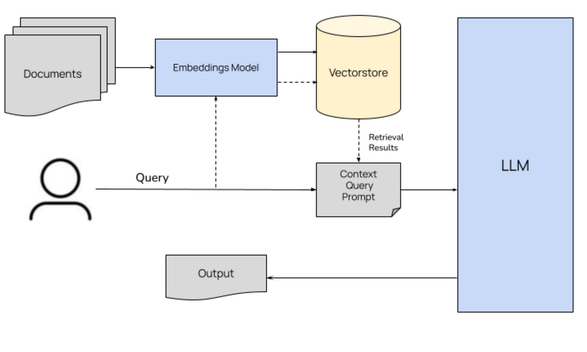

# RAG QA System

This project implements a Retrieval-Augmented Generation (RAG) system for technical documentation using FastAPI, LangChain, and a vector store (Chroma). The system is designed to ingest documents (PDFs and Markdown), index them into a vector database, and then answer user questions by retrieving relevant context and generating answers using an LLM (Ollama).

---

## Table of Contents
- [Features](#Features)
- [System Architecture Overview](#system-architecture-overview)
- [Setup Instructions](#setup-instructions)
- [API Usage Examples](#api-usage-examples)
- [RAG Evaluation](#rag-evaluation)
- [Explanation of RAG Implementation Choices](#explanation-of-rag-implementation-choices)
- [Ideas for Future Improvements](#ideas-for-future-improvements)

---
## Features
- **PDF / Markdown Ingestion and preprocessing**: Easily upload PDF or Markdown files, split it and create vector embeddings in the backend.
- **Retrieval-Augmented Generation**: Combines language model capabilities with context retrieved from the ingested documents.
- **Basic RAG evaluation**: Perform basic evaluation to RAG system.
- **Metrics & Monitoring**:
  - Total requests
  - Success/failure rates
  - Average response times
  - Token usage
- **Security**: Requires an API key (sent in the `X-API-Key` header).
- **Swagger Documentations**: Api documentations in `YOUR_HOST/docs`


## System Architecture Overview
This diagram explain Question answering mechanism\
\
This diagram explain Document ingestion mechanism\
\
The system is composed of several components:

- **Document Ingestion Service**  
  This component loads, splits, and embeds documents into a vector store. It uses:
- **Question Answering Service**  
  This service receives a question, retrieves relevant document chunks from the vector store based on similarity, augments the prompt with the retrieved context, and then generates an answer using an LLM via Ollama.

- **LLM Integration (Ollama)**  
  The LLM service (Ollama) is run in a separate container. The application accesses it via Docker networking.
- **API services**
  The API provide several service to access the Question answering, ingestion, clear database, and see the performance metrics feature. The API also secured by depedencies to verify api key.
- **Docker-based Deployment**  
  The system leverages Docker Compose to manage multiple services:
  - **app:** Runs the FastAPI application.
  - **ollama:** Hosts the LLM service.
  - **chroma:** Runs the Chroma vector store.

This modular architecture allows for scalability and easier maintenance of individual components.
---
## Setup Instructions

### 1. Clone the Project Repository
Run the following command to clone the repository:
```sh
git clone https://github.com/mrsuiii/QA-RAG.git
```

Change into the project directory:
```sh
cd QA-RAG
```

---
### 2. Create .env 
create .env file in the same level as docker-compose and write
```
API_KEY = any key you want
```
### 3. Build and Start the Application
Use Docker Compose to build and start the application(make sure u open the docker desktop first if using windows):
```sh
docker compose up -d --build
```

This command will build the necessary images and start the services in detached mode.

---

### 4. Read the API Usage Examples
Refer to the [API Usage Examples](#api-usage-examples) for instructions on how to interact with the application.

---
## API Usage Examples

### Authentication
All requests must include an API key in the header:
```http
X-API-Key: same as in the env file you made
```

---

### 1. Upload and Ingest a Document
#### Endpoint: `/ingest`
**Method:** `POST`

**Description:** Upload and ingest a document file (PDF or Markdown).

#### Request Example:
```http
POST /ingest HTTP/1.1
Host: YOUR_HOST:8001
X-API-Key: YOUR_API_KEY
Content-Type: multipart/form-data
```
**Body:**
```form-data
documents: example.pdf or example.md
```

#### Response Example:
```json
{
    "detail": "File processed successfully."
}
```

---

### 2. Generate a Response to a Query
#### Endpoint: `/generate`
**Method:** `POST`

**Description:** Answer a question with context from ingested documents.

#### Request Example:
```http
POST /generate HTTP/1.1
Host: YOUR_HOST:8001
X-API-Key: YOUR_API_KEY
Content-Type: application/json
```
**Body:**
```json
{
    "query": "What is the purpose of retrieval-augmented generation?"
}
```

#### Response Example:
```json
{
    "query": "What is the purpose of retrieval-augmented generation?",
    "response": "Retrieval-augmented generation enhances responses by leveraging external document sources.",
    "sources(context)": "[Document 1, Document 2]",
    "token_count": 123
}
```

---

### 3. Retrieve API Metrics
#### Endpoint: `/stats`
**Method:** `GET`

**Description:** Retrieve system metrics, including total requests and token usage.

#### Request Example:
```http
GET /stats HTTP/1.1
Host: YOUR_HOST:8001
X-API-Key: YOUR_API_KEY
```

#### Response Example:
```json
{
    "total_requests": 10,
    "total_success_requests": 9,
    "total_failed_requests": 1,
    "average_process_time": 0.25,
    "ingest_requests": 5,
    "generate_requests": 5,
    "total_tokens_used": 567
}
```

---

### 4. Clear the Vector Database
#### Endpoint: `/clear_database`
**Method:** `DELETE`

**Description:** Remove all stored vectors/documents from the database.

#### Request Example:
```http
DELETE /clear_database HTTP/1.1
Host: YOUR_HOST:8001
X-API-Key: YOUR_API_KEY
```

#### Response Example:
```json
{
    "detail": "Deleted 120 vectors from the database."
}
```

---

### Running the API Locally
To run the FastAPI server locally, use the following command:
```sh
uvicorn main:app --host 0.0.0.0 --port 8001 --reload
```
---
### RAG Evaluation
To perform RAG evaluation you must go to rag directory in your app container and go to rag directory and run eval.py. It will perform evaluation with basic accuracy metric.
```
python eval.py
```

---
## Explanation of RAG Implementation Choices
\
(This picture i got from https://llmstack.ai/assets/images/rag-f517f1f834bdbb94a87765e0edd40ff2.png but basically the implementation architecture is same as mine so i just use this picture).\
The system adopts a Basic Retrieval-Augmented Generation (RAG) approach. 
1. User input a query.
2. System embedd the query into vector and do similarity search in vector stores to find 5 relevan chunks.
3. The 5 relevant chunks is augmented into a formatted prompt.
4. The prompt invoked to LLM instance and will give the response. 
The prompt is designed so the LLM can answer based on context and give citation in the answer. Here is the prompt template
"""
You are a technical documentation assistant.
Your task is to answer the following question using only the information provided in the context.
Ensure that your answer is concise, accurate, and directly supported by the context.
Whenever you reference supporting information, include only its citation in the format [Source ID: n] (do not include any excerpts or snippet text from the context).
If the context does not contain enough information to answer the question, state that explicitly.

Context:
{context}

Question: {question}

Answer (with citations): 
"""\
Here are the key design decisions behind its implementation:

- **Document Ingestion & Splitting:**  
  - **Loaders:** Specialized loaders (`PyPDFLoader` and `UnstructuredMarkdownLoader`) reliably extract content from PDF and Markdown documents.
  - **Text Splitting:** A `RecursiveCharacterTextSplitter` divides large documents into smaller, coherent chunks, allowing for more focused retrieval during query processing.

- **Embedding Strategy:**  
  - **Model Selection:** A SentenceTransformer-based model (e.g., `"all-MiniLM-L6-v2"`) is used to generate dense vector embeddings that capture semantic meaning efficiently.
  - **Vector Store:** Chroma is used to store these embeddings. Its support for both embedded and client-server modes provides flexibility and scalability for similarity search.

- **LLM Integration with Ollama:**  
  - **Uses llama3.2:1b (via Ollama)** : The lightweight model that Ollama provided.
  - **Separation of Concerns:** Running the LLM (via Ollama) in its own container decouples text generation from ingestion and retrieval, enabling independent scaling and easier maintenance.
  
- **Docker-Based Deployment:**  
  - The use of Docker Compose ensures that each component (the FastAPI app, Ollama service, and Chroma vector store) runs in a consistent, isolated environment while communicating over a shared network.
  
---

## Ideas for Future Improvements

1. **Scalability & Performance:**
   - **Distributed Vector Store:** Consider migrating to a distributed vector store solution to handle larger datasets and increased query loads.
   - **Caching Strategies:** Introduce caching for frequently queried responses to reduce computational overhead.
   - **GPU Usage:** Use GPU instead of CPU for llm inferencing will certainly improve the response time.

2. **Enhanced Security:**
   - **Advanced Authentication:** Implement robust authentication mechanisms such as OAuth2 or JWT to secure API endpoints.
   - **Secure Secrets Management:** Use Docker secrets or external secret management tools to handle sensitive data (e.g., API keys).

3. **Improved RAG Pipeline:**
   - **Dynamic Prompt Engineering:** Develop adaptive prompt templates that adjust based on the query context to improve response quality.
   - **Context Optimization:** Experiment with various text splitting strategies and context window sizes to optimize the retrieval and augmentation process.
   - **Use Larger Model:** If there is enough resource we can use the larger model such as deepseek or llama larger with larger parameters.

4. **Monitoring & Logging:**
   - **Observability Tools:** Integrate monitoring systems (e.g., Prometheus and Grafana) to track performance metrics and system health.
   - **Structured Logging:** Adopt structured logging and error tracking (using tools like ELK Stack or Sentry) for more efficient debugging and incident resolution.

5. **User Experience Enhancements:**
   - **Interactive Frontend:** Build a user-friendly web interface for document ingestion, query submission, and real-time feedback.
  
